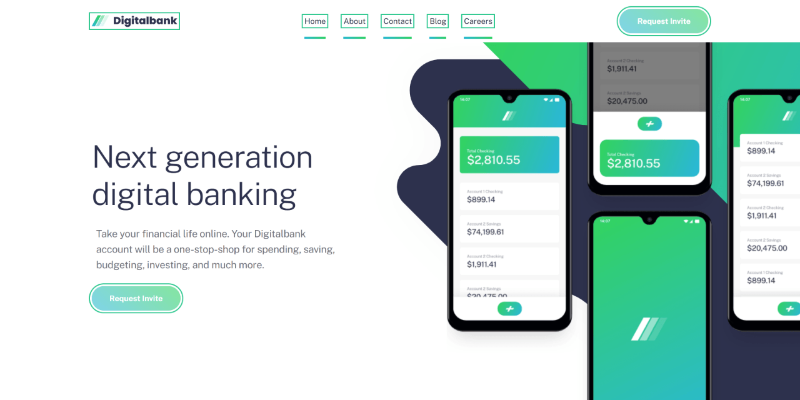

# 🚀 Digitalbank landing page

Modern responsive landing page built with semantic HTML, scalable CSS architecture, accessibility-focused interactions, and vanilla JavaScript.

This is a solution to the [Digitalbank landing page challenge on Frontend Mentor](https://www.frontendmentor.io/challenges/digital-bank-landing-page-WaUhkoDN).

---

## Links

- 🌎 [Live site](https://vimpdev.github.io/fem-intermediate-htmlcss-01-digital-bank-landing-page/)
- 📌 [Frontend Mentor solution](https://www.frontendmentor.io/solutions/digitalbank-landing-page-modern-css-accessibility-and-responsive-ui-LrxD8U1-1z)

---

## 🎬 Demo

---

## 📸 Screenshots

### 📱 Mobile

|  |  |
| --- | --- |

### 📲 Tablet

|  |  |
| --- | --- |

### 🖥️ Desktop

#### Default
|  |  |  |
| --- | --- | --- |

#### Hover states
|  |  |
| --- | --- |

#### Focus Visible states
|  |  |
| --- | --- |

---

## ✨ Features

- Responsive layouts for mobile, tablet, and desktop
- Interactive mobile navigation menu
- Accessible `hover` and `focus-visible` states
- Semantic HTML structure
- Scalable CSS architecture using `@layer`
- Reusable utility classes
- BEM-inspired naming convention
- Mobile-first workflow
- CSS Grid and Flexbox layouts
- Optimized SVG backgrounds and assets
- SEO and social sharing meta tags

---

## 🛠️ Built With

- Semantic HTML5
- Modern CSS
  - `@layer`
  - CSS Custom Properties
  - CSS Nesting
  - Flexbox
  - CSS Grid
- Vanilla JavaScript
- Mobile-first workflow
- BEM-inspired class naming

---

## 🧠 What I Learned

This project helped me strengthen my understanding of responsive layouts, CSS architecture, accessibility, and UI interactions.

### CSS Architecture

I learned how to organize styles using:

- @layer
- design tokens
- utility classes
- component separation
- responsive layers
- state layers

This made the stylesheet easier to scale and maintain.

### Responsive Layout Techniques

While building the hero section, I worked with:

- complex CSS Grid layouts
- overflowing images
- full-viewport background techniques
- responsive positioning
- desktop image composition

I also learned the difference between controlling layout with:

- `max-inline-size`
- `inline-size`
- `overflow`
- transforms
- absolute positioning

### Accessibility

I implemented proper interactive states using:

- `:hover`
- `:focus-visible`
- accessible navigation attributes
- keyboard-friendly interactions

### JavaScript

I built the mobile navigation menu using vanilla JavaScript:

- toggle menu logic
- dynamic icon switching
- `data-*` attributes
- ARIA state updates
- overlay interactions
- automatic menu closing on navigation click

---

## 🎯 Key Technical Decisions

- Used CSS custom properties for scalable spacing, typography, and colors
- Used `@layer` to prevent style conflicts and improve maintainability
- Used CSS nesting to reduce repetitive selectors
- Avoided framework dependencies to strengthen core frontend skills
- Built mobile-first before scaling to tablet and desktop
- Separated layout, components, utilities, responsive rules, and states

---

## 🤖 AI Collaboration

AI tools were used during development to:

- Debug responsive layout issues
- Review CSS architecture decisions
- Improve accessibility and interactive states
- Refine component structure and naming
- Better understand modern CSS features like `@layer` and nesting

They were mainly useful for quick feedback, clarification, and iteration.

---

## 👩‍💻 Author

- Frontend Mentor – [@vimpdev](https://www.frontendmentor.io/profile/vimpdev)

---